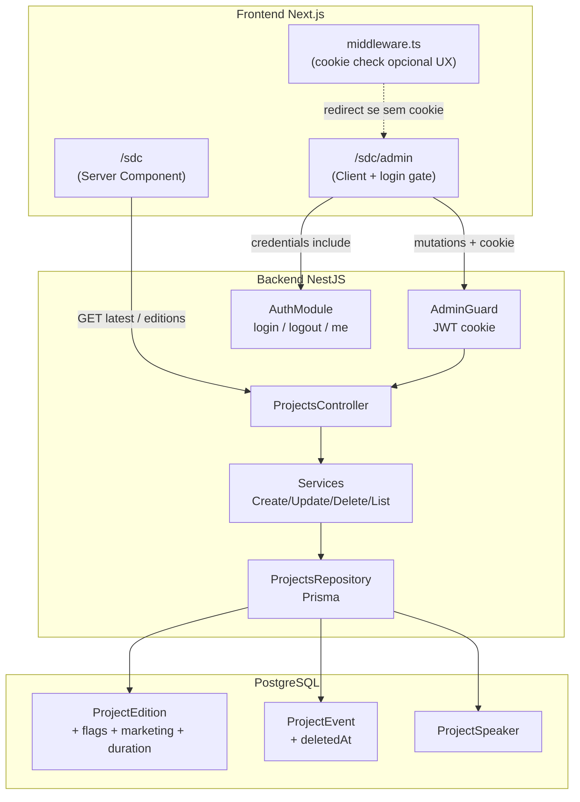
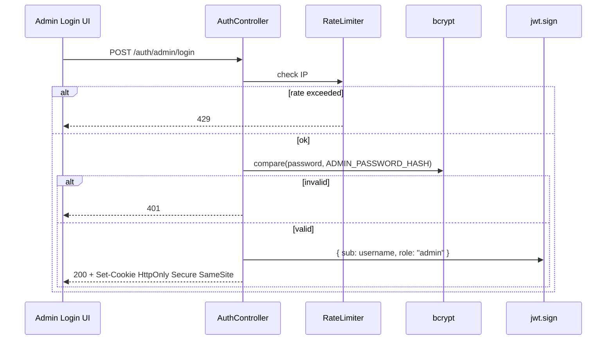
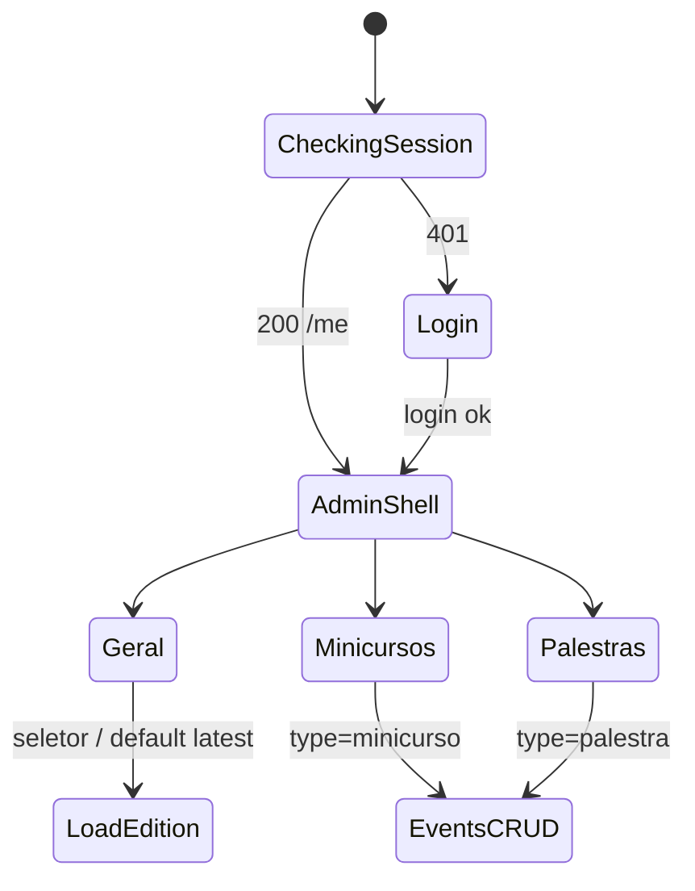
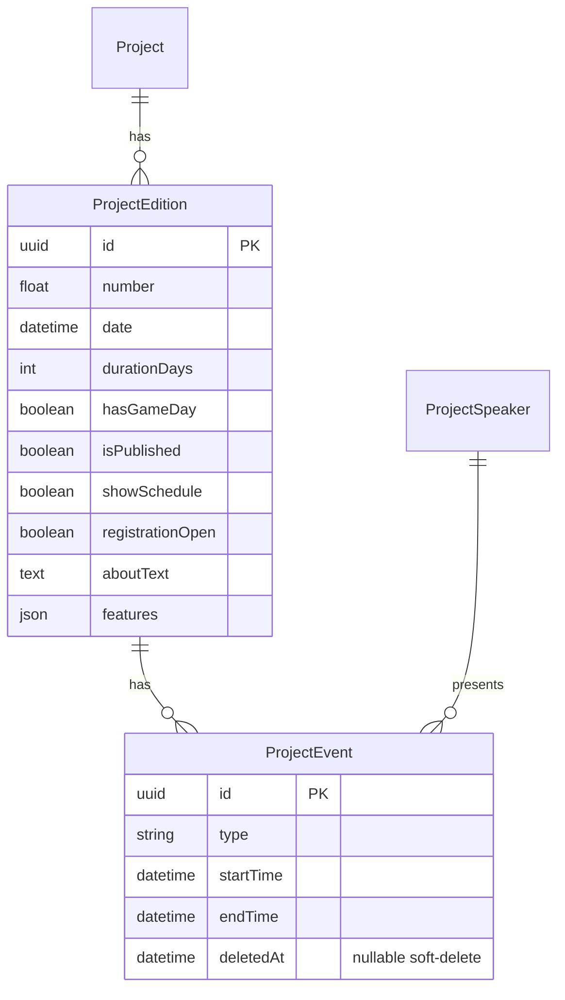
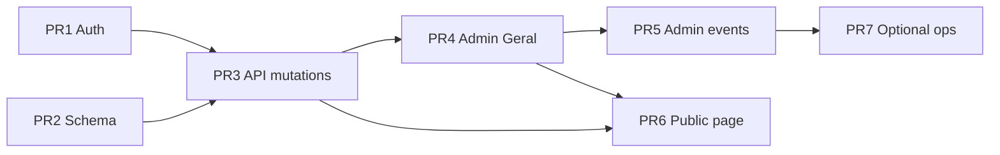

# Design Document: SDC Admin — Gestão da Página e Edição em `/sdc/admin`

| Campo | Valor |
| --- | --- |
| **Título** | SDC Admin: gerenciar página e edição da Semana de Computação |
| **Autor** | _a preencher_ |
| **Data** | 2026-07-14 |
| **Status** | Draft |
| **Repositório** | `pet-site` (monorepo Next.js + NestJS + Prisma/PostgreSQL) |
| **Produto** | [https://petccufpb.com](https://petccufpb.com) — PET Computação UFPB |
| **Escopo** | Admin em `/sdc/admin`, schema `ProjectEdition`/`ProjectEvent`, APIs de projects, página pública `/sdc` |

---

## Overview

A página pública da SDC (`frontend/src/app/sdc/page.tsx`) já consome a última edição e seus eventos via `GET /projects/editions/latest?project=SDC`, mas grande parte do conteúdo de marketing permanece hardcoded (`FeatureList`, texto “Sobre”, flag `SDC_READY`). O painel em `frontend/src/app/sdc/admin/page.tsx` é um esqueleto visual: formulários não chamam API, abas de minicursos/palestras estão incompletas e não há autenticação. No backend, existem apenas operações de **CREATE** para edição/evento/palestrante; faltam **UPDATE/DELETE**, listagem de speakers e política de exclusão segura de eventos com histórico (participações, presenças, certificados).

Este design propõe um fluxo completo e incremental: (1) módulo de autenticação de admin (conta única, bcrypt + JWT em cookie HttpOnly + `AdminGuard` + rate limit); (2) migração de schema com flags de publicação, conteúdo marketing editável, `durationDays`/`hasGameDay` e soft-delete de eventos; (3) endpoints de mutação protegidos; (4) admin UI funcional por abas; (5) página pública consumindo flags e conteúdo da edição. A implementação é fatiada em PRs independentes e mergeáveis em sequência.

---

## Background & Motivation

### Estado atual (código)

| Área | Estado | Arquivos-chave |
| --- | --- | --- |
| Página pública SDC | Parcialmente data-driven; `SDC_READY = true` hardcoded | `frontend/src/app/sdc/page.tsx`, `components/ScheduleDesc` |
| Sobre | Texto fixo no componente | `frontend/src/app/sdc/components/Head/index.tsx` |
| Features | 4 cards hardcoded (Networking, Minicursos, Certificados, Coffee Break) | `frontend/src/app/sdc/components/FeaturesList/index.tsx` |
| Admin UI | Skeleton: Zod schema com `edition`, `days`, `startDate`, `endDate`, toggle Gameday; sem `onSubmit`/API; aba palestras ausente | `frontend/src/app/sdc/admin/page.tsx` |
| Auth API | Basic-auth Express **comentado** em `main.ts` (“Todo: block API unless logged in”) | `backend/src/main.ts` L28–56 |
| Mutações backend | POST project/edition/event/speaker; DELETE só em participations | `projects.controller.ts` |
| Speakers | Só `POST /projects/speakers`; sem GET/PATCH/DELETE | controller + `CreateSpeaker` |
| Schema `ProjectEdition` | `name`, `number`, `date`, `logoUrl`, `minimumAttendance`, relações | `backend/prisma/schema.prisma` L98–113 |
| Schema `ProjectEvent` | Sem soft-delete; `type` ∈ `main \| minicurso \| palestra` | schema L115–138; `CreateEvent.dto.ts` |
| “Latest edition” | `findAllEditions` ordena `date: desc` e retorna `editions[0]` | `FindLatestEdition.service.ts`, repositório Prisma |
| bcrypt | Já em `backend/package.json` (`bcrypt@^6.0.0`); **sem** JWT/cookie-parser no backend | — |
| Cache | `CacheInterceptor` global (Redis, TTL 5 min) fora de env `RAILWAY_ENVIRONMENT=development` | `app.module.ts` |

### Dores

1. **Operação manual e arriscada**: alterar programação ou “prontidão” da SDC exige deploy de frontend (`SDC_READY`, textos, features).
2. **Admin inútil em produção**: UI existe e gera expectativa, mas não persiste dados.
3. **API aberta a mutações**: com basic-auth comentado, POSTs de edição/evento/speaker não exigem identidade de admin.
4. **Sem correção pós-criação**: erros de horário, speaker ou descrição só se resolvem com SQL/Prisma Studio.
5. **Risco de perda de histórico**: hard delete cego de eventos com participações/certificados quebraria integridade e auditoria.

### Motivação de negócio

A SDC ocorre periodicamente. O PET precisa publicar/ocultar programação, abrir/fechar inscrições e ajustar textos sem ciclo de release. Manter `durationDays` + `hasGameDay` no modelo alinha o esqueleto do admin com a realidade do evento (janela multi-dia + Gameday opcional).

---

## Goals & Non-Goals

### Goals

1. **Auth de admin segura** (conta única): senha via hash bcrypt em env; JWT em cookie HttpOnly; `AdminGuard` em mutações de escrita admin; rate limit no login.
2. **Schema de edição completo** para operação e publicação:
   - `isPublished`, `showSchedule` (substitui `SDC_READY`), `registrationOpen`
   - `aboutText`, `features` (JSON)
   - `durationDays`, `hasGameDay`
3. **Soft-delete de eventos** (`deletedAt`) + hard delete condicional + restore.
4. **CRUD backend** de edition/event/speaker (PATCH/DELETE; GET speakers; listagens ordenadas).
5. **Admin `/sdc/admin` funcional**: seletor de edição (default = latest), abas Geral / Minicursos / Palestras (+ speakers), flags e marketing.
6. **Página pública `/sdc`** consumindo flags e conteúdo; fallbacks para copy atual se `aboutText`/`features` nulos/vazios.
7. **Validação de janela**: eventos devem cair em `[date, date + durationDays)`.
8. **Rollout incremental** via PRs (ver seção PR Plan).

### Non-Goals (MVP)

- Multi-admin / RBAC / OAuth / SSO.
- Browser basic-auth como UX primária de login do admin.
- Editor de Instagram/CTAs de marketing (permanecem hardcoded no MVP).
- Upload de assets no admin (logo continua URL; `photoUrl` de speaker como hoje).
- Gestão completa de participantes/certificados no admin (PR opcional #7).
- CMS genérico multi-projeto além de SDC (APIs continuam genéricas em `projects`, UI focada em SDC).
- Reintroduzir o middleware Express de basic-auth global comentado em `main.ts` (substituído por `AdminGuard` seletivo).
- Internacionalização / i18n.
- App mobile nativo.

---

## Proposed Design

### Arquitetura de alto nível



### Decisões de domínio já aprovadas (fechadas)

| Decisão | Comportamento |
| --- | --- |
| Auth | Conta única; bcrypt(env); JWT HttpOnly cookie; AdminGuard; rate limit login |
| Gameday / dias | Manter no schema; fim da edição = `date + durationDays`; validar eventos na janela |
| Edições no admin | Default = latest + seletor histórico |
| Público `/sdc` | Sempre latest apenas |
| Delete de evento | Hard só se vazio; senão bloquear; soft-delete + restore opcional |
| Marketing | `aboutText` + `features[]` por edição; fallback hardcoded; Instagram/CTAs fixos no MVP |

### 1. Autenticação de admin

#### Modelo

Não há tabela `Admin` no MVP. Credenciais:

```bash
# backend env
ADMIN_USERNAME=pet-admin          # opcional; default "admin"
ADMIN_PASSWORD_HASH=$2b$12$...    # bcrypt hash da senha
JWT_SECRET=<random 32+ bytes>
JWT_EXPIRES_IN=8h                 # opcional
COOKIE_NAME=pet_admin_token       # opcional
```

Geração do hash (one-shot, local):

```bash
node -e "require('bcrypt').hash('SENHA', 12).then(console.log)"
```

#### Dependências backend a adicionar

- `jsonwebtoken` (ou `@nestjs/jwt` + `@nestjs/passport` se preferir ecossistema Nest — **recomendação**: `@nestjs/jwt` + cookie parser leve, sem passport, para superfície mínima de conta única).
- `cookie-parser` (ou leitura manual de `req.cookies` via middleware).
- `@types/bcrypt`, `@types/jsonwebtoken`, `@types/cookie-parser` em dev.

`bcrypt` já existe em `backend/package.json`.

#### Endpoints Auth

| Método | Rota | Auth | Descrição |
| --- | --- | --- | --- |
| `POST` | `/auth/admin/login` | público + rate limit | body `{ username, password }` → set-cookie JWT |
| `POST` | `/auth/admin/logout` | cookie opcional | limpa cookie |
| `GET` | `/auth/admin/me` | AdminGuard | `{ username }` se válido; 401 senão |

**Login flow:**



**Cookie:**

- `HttpOnly: true`
- `Secure: true` em production
- `SameSite: 'lax'` (ou `'none'` + Secure se front/back em origens distintas sem proxy — ver CORS abaixo)
- `Path: /`
- `Max-Age` alinhado a `JWT_EXPIRES_IN`

**CORS:** hoje `NestFactory.create(AppModule, { cors: true })`. Para cookies cross-origin, ajustar para:

```ts
app.enableCors({
  origin: process.env.WEB_URL, // ex. https://petccufpb.com
  credentials: true,
});
```

Frontend axios (`frontend/src/services/api.ts`) deve usar `withCredentials: true` nas rotas admin/auth.

**Rate limit no login:**

- Preferência: contador em memória por IP (Map + janela deslizante) se Redis não for confiável em cold start; **melhor**: reutilizar Redis (`REDIS_URL` já usado em `CacheModule`) com chave `admin-login:{ip}`, limite sugerido **10 tentativas / 15 min**, resposta `429`.
- Não revelar se username ou password falhou (mensagem única).

**AdminGuard:**

```ts
// Pseudocódigo — backend/src/modules/auth/guards/admin.guard.ts
@Injectable()
export class AdminGuard implements CanActivate {
  canActivate(ctx: ExecutionContext): boolean {
    const req = ctx.switchToHttp().getRequest();
    const token = req.cookies?.[COOKIE_NAME];
    if (!token) throw new UnauthorizedException();
    try {
      const payload = jwt.verify(token, process.env.JWT_SECRET!);
      if (payload.role !== "admin") throw new UnauthorizedException();
      req.admin = payload;
      return true;
    } catch {
      throw new UnauthorizedException();
    }
  }
}
```

**Aplicação do guard (mutações admin):**

| Rota existente / nova | Guard? |
| --- | --- |
| `POST /projects`, `POST /projects/editions`, `POST /projects/events`, `POST /projects/speakers` | **Sim** (hoje abertos) |
| `PATCH/DELETE` edition/event/speaker | **Sim** |
| `POST /projects/certificates*` (geração em massa) | **Sim** (recomendado; já é operação privilegiada) |
| `GET` públicos (latest, events, certificates list, validate) | **Não** |
| `POST` participant/participation/attendance | **Não** (fluxos públicos de inscrição/frequência) |
| Auth login/logout/me | conforme tabela acima |

> **Nota:** mutações públicas legítimas (inscrição, presença) **não** recebem `AdminGuard`. O comentário em `main.ts` sobre basic-auth global fica obsoleto; não reativar middleware cego em todos os POSTs.

**Frontend gate:**

- Página de login embutida em `/sdc/admin` (ou `/sdc/admin/login`).
- Ao montar admin: `GET /auth/admin/me` com credentials; se 401, mostrar form de login.
- Opcional (UX only): `middleware.ts` checa presença do cookie e redireciona — **não** substitui AdminGuard (cookie pode ser forjado/ausente no edge).

### 2. Mudanças de schema (Prisma)

#### `ProjectEdition`

```prisma
model ProjectEdition {
  id                  String                       @id @default(uuid())
  name                String?
  number              Float
  date                DateTime                     // início (fonte da verdade)
  durationDays        Int                          @default(5)
  hasGameDay          Boolean                      @default(false)
  logoUrl             String?
  minimumAttendance   Int                          @default(100)

  // Publicação / UX pública
  isPublished         Boolean                      @default(false)
  showSchedule        Boolean                      @default(false)  // substitui SDC_READY
  registrationOpen    Boolean                      @default(false)

  // Marketing editável
  aboutText           String?                      @db.Text
  features            Json?                        // FeatureCard[] | null

  // ... relações existentes inalteradas
  certificateTemplate ProjectCertificateTemplate[]
  certificates        ProjectCertificate[]
  events              ProjectEvent[]
  participants        ProjectParticipation[]
  projectId           String
  project             Project                      @relation(fields: [projectId], references: [id])
  createdAt           DateTime                     @default(now())
  updatedAt           DateTime                     @updatedAt
}
```

**Tipo de `features` (contrato JSON):**

```ts
type FeatureIconKey =
  | "networking"
  | "minicurso"
  | "certificate"
  | "coffee-break";
  // extensível: mapear em FeaturesList para SVGs existentes em public/images

type FeatureCard = {
  title: string;
  description: string;
  iconKey: FeatureIconKey;
};
```

**Defaults de migração (dados existentes):**

| Campo | Default na migration | Justificativa |
| --- | --- | --- |
| `durationDays` | `5` | alinhado a UI atual (máscara 1 dígito, min schema Zod admin era 10 — **corrigir** validação UI para min 1) |
| `hasGameDay` | `false` | seguro |
| `isPublished` | `true` para edições existentes **ou** `false`? | **Recomendação:** `true` nas existentes para não “despublicar” SDC em produção no deploy da migration; novas edições criadas no admin começam `isPublished=false` via DTO default de create |
| `showSchedule` | `true` se produção hoje usa `SDC_READY=true` | preservar comportamento atual |
| `registrationOpen` | `true` se inscrição está aberta no momento do deploy | ajustar manualmente no admin pós-deploy se necessário |
| `aboutText` / `features` | `NULL` | ativa fallback hardcoded no front |

> Implementação concreta dos defaults de `isPublished`/`showSchedule`/`registrationOpen` na migration SQL deve ser revisada no PR de schema com snapshot do estado de produção.

#### `ProjectEvent`

```prisma
model ProjectEvent {
  // ... campos existentes
  deletedAt           DateTime?
  // ...
}
```

Índice opcional: `@@index([editionId, deletedAt])` para listagens filtradas.

#### Janela da edição (derivada)

```ts
function editionWindow(edition: { date: Date; durationDays: number }) {
  const start = startOfDay(edition.date); // ou usar instant ISO como hoje
  const end = addDays(start, edition.durationDays); // exclusive end
  return { start, end };
}
// Evento válido se: startTime >= start && endTime <= end
// (mesma regra em CreateEvent e UpdateEvent)
```

**UI admin Geral:**

- Campos editáveis: número, nome, data início, `durationDays`, `hasGameDay`, logoUrl, flags, about, features.
- **Data de término** exibida como **somente leitura** = `date + durationDays` (não persistir `endDate` separado).
- Remover `endDate` do schema Zod atual do skeleton (`sendFormSchema`).

### 3. Política de delete de eventos

```mermaid
flowchart TD
  A[DELETE /projects/events?id=] --> B{query soft=true?}
  B -->|sim| C[UPDATE deletedAt = now]
  B -->|não / hard| D{tem participations OU attendances OU certificates?}
  D -->|sim| E[409 Conflict\n"Evento possui vínculos; use soft-delete"]
  D -->|não| F[DELETE físico]
  C --> G[200]
  F --> G
```

- **Soft-delete** (`deletedAt = now()`): evento some da programação pública e de listagens admin “ativas”; permanece no banco.
- **Restore**: `PATCH .../restore` ou `PATCH` com `{ deletedAt: null }`.
- **Hard delete**: só se contagens de `participants`, `attendees`, `certificates` (e, por segurança, `certificateTemplate` ligados ao event) forem zero; caso contrário **409**.
- Listagens públicas (`findAllEditions` events include, `findEventsByEdition`): filtrar `deletedAt: null` por default.
- Admin list events: query `includeDeleted=true` opcional.

### 4. Endpoints backend (projects)

Padrão atual: controller gordo em `ProjectsController`, services por caso de uso, `ProjectsRepository` abstrato + Prisma + Fake. **Manter o padrão.**

#### Edições

| Método | Rota | Guard | Body / Query | Comportamento |
| --- | --- | --- | --- | --- |
| `GET` | `/projects/editions` | não | `project`, `id` | ordenar por `number desc` **e** `date desc` (estável) |
| `GET` | `/projects/editions/latest` | não | `project` required | mesma ordenação; se `isPublished=false`, decidir: **público retorna latest published** vs raw latest — ver abaixo |
| `POST` | `/projects/editions` | sim | `CreateEditionDTO` estendido | defaults flags; `durationDays`, `hasGameDay` |
| `PATCH` | `/projects/editions` | sim | `id` + campos parciais | `UpdateEdition` |
| `DELETE` | `/projects/editions` | sim | `id` | **fora do MVP crítico** ou só se sem eventos/participações; preferir despublicar (`isPublished=false`) |

**Latest publicado (recomendação):**

- `GET /projects/editions/latest?project=SDC` (público): retorna a edição com maior `number`/`date` onde `isPublished = true`. Se nenhuma, 404 com mensagem amigável (front pode mostrar “em breve”).
- Admin usa `GET /projects/editions?project=SDC` (todas, inclusive não publicadas) + seletor.

**Ajuste em `FindLatestEdition.service.ts`:**

```ts
// Hoje:
const editions = await this.projectsRepository.findAllEditions(project.id);
return editions[0];

// Proposto:
const edition = await this.projectsRepository.findLatestPublishedEdition(project.id);
if (!edition) throw new HttpException("Nenhuma edição publicada", HttpStatus.NOT_FOUND);
return edition;
```

Repositório: `orderBy: [{ number: "desc" }, { date: "desc" }]`, `where: { projectId, isPublished: true }`, include events com `deletedAt: null`.

> Observação: `findAllEditions` **já** ordena `date: desc` (Prisma L121–123). Ainda assim, explicitar `number desc` evita ambiguidade se duas edições compartilharem data.

#### Eventos

| Método | Rota | Guard | Notas |
| --- | --- | --- | --- |
| `GET` | `/projects/events` | não* | filtrar soft-deleted; admin passa `includeDeleted` + cookie |
| `POST` | `/projects/events` | sim | validar janela da edição + regras atuais (onSite/location, overlap) |
| `PATCH` | `/projects/events` | sim | `UpdateEventDTO` parcial |
| `DELETE` | `/projects/events` | sim | `?id=&mode=hard\|soft` (default soft) |
| `POST` | `/projects/events/restore` | sim | ` { id } ` |

\*Listagem com `includeDeleted` exige AdminGuard.

#### Speakers

| Método | Rota | Guard | Notas |
| --- | --- | --- | --- |
| `GET` | `/projects/speakers` | não ou admin | lista para selects do admin; público mínimo se necessário |
| `POST` | `/projects/speakers` | sim | existente |
| `PATCH` | `/projects/speakers` | sim | name, about, photoUrl |
| `DELETE` | `/projects/speakers` | sim | bloquear se houver events ativos referenciando |

#### DTOs novos (esboço)

```ts
// UpdateEdition.dto.ts
export default class UpdateEditionDTO {
  @IsUUID() id!: string;
  @IsOptional() @IsString() name?: string;
  @IsOptional() @IsNumber() @Min(0) number?: number;
  @IsOptional() @IsDateString() date?: string;
  @IsOptional() @IsInt() @Min(1) @Max(30) durationDays?: number;
  @IsOptional() @IsBoolean() hasGameDay?: boolean;
  @IsOptional() @IsUrl() logoUrl?: string;
  @IsOptional() @IsBoolean() isPublished?: boolean;
  @IsOptional() @IsBoolean() showSchedule?: boolean;
  @IsOptional() @IsBoolean() registrationOpen?: boolean;
  @IsOptional() @IsString() aboutText?: string | null;
  @IsOptional() features?: FeatureCard[] | null; // validar com class-validator nested ou custom
}
```

Estender `CreateEditionDTO` com os mesmos campos opcionais (defaults no service).

### 5. Serviços novos / alterados

Seguir naming existente (`CreateX.service.ts`, specs `*.spec.ts`):

| Service | Ação |
| --- | --- |
| `UpdateEdition` | partial update; revalidar unicidade `number+projectId` se number mudar |
| `DeleteEdition` | opcional MVP; preferir unpublish |
| `UpdateEvent` | partial; revalidar janela e conflito de local |
| `DeleteEvent` | soft/hard conforme política |
| `RestoreEvent` | `deletedAt = null` |
| `UpdateSpeaker` / `DeleteSpeaker` / `ListSpeakers` | CRUD speaker |
| `FindLatestEdition` | published + orderBy number/date |
| `CreateEvent` | estender validação com `durationDays` (hoje só checa `startTime >= edition.date`) |
| `CreateEdition` | aceitar novos campos |

**Validação de janela em `CreateEvent` (gap atual):**

Hoje (`CreateEvent.service.ts` L33–38) só impede início antes de `edition.date`. Após schema:

```ts
const { start, end } = editionWindow(edition);
if (isBefore(startTime, start) || isAfter(endTime, end)) {
  throw new HttpException(
    "Evento fora da janela da edição (início + durationDays)",
    HttpStatus.BAD_REQUEST,
  );
}
```

### 6. Admin UI (`/sdc/admin`)

#### Estrutura proposta

```
frontend/src/app/sdc/admin/
  layout.tsx          # metadata (existente)
  page.tsx            # shell: auth gate + tabs
  login-form.tsx      # ou inline
  components/
    EditionSelector.tsx
    GeralTab.tsx      # flags, about, features, duration, gameday
    EventsTab.tsx     # reutilizado minicursos/palestras via type filter
    SpeakerForm.tsx
    FeatureEditor.tsx
  styles.ts           # estender estilos existentes
```

#### Fluxos de UI



**Aba Geral:**

1. `GET /projects/editions?project=SDC` → seletor (label: `#{number} — {name} — {date}`).
2. Default: primeira da lista (já ordenada desc) = latest.
3. Form controlado com react-hook-form + zod:
   - número, nome, data início, durationDays, hasGameDay, logoUrl
   - checkboxes: isPublished, showSchedule, registrationOpen
   - textarea aboutText
   - editor de lista features (add/remove cards; select iconKey)
   - endDate **derivado** (disabled display)
4. Submit → `PATCH /projects/editions` ou `POST` se “Nova edição”.
5. Botão “Nova edição” limpa form com defaults seguros (flags false, duration 5).

**Abas Minicursos / Palestras:**

1. Filtrar events da edição selecionada por `type`.
2. Tabela: nome, speaker, horário, capacidade, ações editar/soft-delete/restore.
3. Form criar/editar evento + select de speakers (`GET /projects/speakers`) + criar speaker inline.
4. Eventos `type=main` (abertura etc.): opcional na aba Geral ou filtro “Outros” — **recomendação:** terceira sub-secção “Programação geral” na aba Geral ou incluir em Palestras com type `main`. Decisão de UI: **incluir seletor de type no form** com default da aba.

**Auth UX:**

- Sem cookie válido: formulário username/password; não expor resto do admin.
- Logout limpa cookie via API e reseta state.

### 7. Página pública `/sdc`

#### Substituição de `SDC_READY`

```tsx
// page.tsx (conceitual)
const sdcData = await fetchLatest(); // CompleteProjectEdition
const showSchedule = sdcData.showSchedule === true;

// ...
{showSchedule && (
  <>
    <SdcSchedule data={sdcData} />
    <MobileSchedule data={sdcData} />
  </>
)}
```

`ScheduleDesc` deixa de importar `SDC_READY` de `page.tsx` (acoplamento frágil) e recebe `showSchedule` via props.

#### About & Features

```tsx
// Head: usar sdcData.aboutText ?? DEFAULT_ABOUT_TEXT
// FeatureList: receber features prop; se null/[] usar DEFAULT_FEATURES (copy atual)
```

Mapa `iconKey → SVG` reutiliza assets já importados em `FeaturesList`.

#### Flags auxiliares

| Flag | Consumidor |
| --- | --- |
| `isPublished` | latest endpoint filtra; se 404, page pode renderizar `em-breve` / ErrorPage |
| `showSchedule` | agenda + copy ScheduleDesc |
| `registrationOpen` | `inscricao/page.tsx` e botão “GARANTIR MINHA VAGA” no Head: desabilitar/esconder se false; opcional rewrite middleware para `/sdc/em-breve` |

Instagram e CTAs de copy secundária: **permanecem hardcoded** (MVP).

#### Tipos TypeScript

Atualizar `frontend/src/@types/sdc.d.ts` (`SDCScheduleData`) com novos campos da edição.

### 8. Cache Redis

Mutations admin devem **invalidar** cache das rotas GET afetadas (`/projects/editions*`, `/projects/events`) ou usar `Cache-Control` / key versioning. O `CacheInterceptor` global pode servir GET stale por até 5 min após PATCH.

Mitigações (escolher no PR de backend mutations):

1. `@CacheTTL(0)` / `@NoCache()` nos GETs sensíveis (latest), ou
2. Invalidação explícita no service de update (preferível se keys forem previsíveis), ou
3. Manter `cache: "no-store"` no fetch do Next (já usado em `page.tsx`) **e** desabilitar cache interceptor só para paths `/projects/editions` — o interceptor Nest ainda pode cachear respostas para outros clientes.

**Recomendação:** excluir do cache interceptor as rotas `projects/editions` e `projects/events` **ou** invalidar no update; documentar no PR.

---

## API / Interface Changes

### Antes (mutações relevantes)

```
POST   /projects
POST   /projects/editions
GET    /projects/editions
GET    /projects/editions/latest?project=
POST   /projects/events
GET    /projects/events
POST   /projects/speakers
DELETE /projects/participations
```

Sem PATCH; speakers sem GET; sem auth.

### Depois (delta)

```
POST   /auth/admin/login
POST   /auth/admin/logout
GET    /auth/admin/me

PATCH  /projects/editions          # AdminGuard
DELETE /projects/editions          # AdminGuard (opcional / restrito)

PATCH  /projects/events            # AdminGuard
DELETE /projects/events            # AdminGuard (soft|hard)
POST   /projects/events/restore    # AdminGuard

GET    /projects/speakers
PATCH  /projects/speakers          # AdminGuard
DELETE /projects/speakers          # AdminGuard

# POST existentes de edition/event/speaker/project passam a exigir AdminGuard
```

### Exemplos de payload

**Login**

```http
POST /auth/admin/login
Content-Type: application/json

{ "username": "admin", "password": "..." }
```

```http
HTTP/1.1 200
Set-Cookie: pet_admin_token=eyJ...; HttpOnly; Secure; SameSite=Lax; Path=/; Max-Age=28800
```

**Update edition**

```json
{
  "id": "uuid",
  "showSchedule": true,
  "registrationOpen": true,
  "aboutText": "Todo semestre o PET...",
  "features": [
    {
      "title": "100% NETWORKING",
      "description": "Compartilhe todas suas experiências e faça novos amigos.",
      "iconKey": "networking"
    }
  ],
  "durationDays": 5,
  "hasGameDay": true
}
```

**Soft delete event**

```http
DELETE /projects/events?id=<uuid>&mode=soft
```

---

## Data Model Changes

### Diagrama ER (delta)



### Migration strategy

1. PR de schema: `pnpm -F backend migrate` gera migration SQL.
2. Colunas com defaults **NOT NULL** onde aplicável (`durationDays`, booleans) para não quebrar leituras.
3. `aboutText` / `features` / `deletedAt` nullable.
4. Deploy order: **migration first** (compatível com código antigo — colunas novas ignoradas), depois backend, depois frontend.
5. Backfill opcional SQL se quiser `showSchedule = true` só na latest.

### Compatibilidade

Código antigo que faz `createEdition` sem novos campos continua válido graças a defaults Prisma/DB. Frontend antigo ignora campos extras no JSON. Remoção de `SDC_READY` no front deve ser **após** backend já retornar `showSchedule`.

---

## Alternatives Considered

### 1. Auth: Basic-auth global (reabilitar `main.ts`) vs JWT cookie

| Critério | Basic-auth global | JWT HttpOnly (escolhido) |
| --- | --- | --- |
| UX admin | Prompt nativo do browser | Form dedicado, logout limpo |
| Granularidade | Difícil isentar inscrição/frequência | Guard por rota |
| XSS | Credencial em header/session browser | Cookie HttpOnly mitiga roubo via JS |
| CSRF | Menor com basic | Mitigar com SameSite + origin check |
| Alinhamento | Já esboçado e **rejeitado** como UX primária | Decisão de produto aprovada |

### 2. Soft-delete vs archive table vs hard-only

| Critério | Soft-delete `deletedAt` (escolhido) | Tabela archive | Hard-only com block |
| --- | --- | --- | --- |
| Esconder da agenda | Sim | Sim | Não sem delete |
| Histórico certificados | Mantém FKs | Move dados | Perde se forçar |
| Complexidade queries | Filtro `deletedAt null` | Joins/ETL | Mínima |
| Restore | Trivial | Reimport | Impossível |

Hard-only bloqueado quando há vínculos é **complementar**, não alternativa exclusiva.

### 3. Conteúdo marketing em CMS externo (Sanity/Contentful) vs colunas na edição

| Critério | Colunas na `ProjectEdition` (escolhido) | CMS externo |
| --- | --- | --- |
| Ops PET | Um admin só | Segunda ferramenta |
| Acoplamento por edição | Natural | Precisa de IDs externos |
| Custo/infra | Zero extra | Conta + sync |
| Flexibilidade layout | Limitada a cards | Alta |

MVP elege colunas JSON/text; CMS fica para eventual redesign de site.

### 4. Multi-admin com tabela `User` vs conta única env

Conta única em env reduz superfície e tempo de entrega. Tabela `User` adiada até haver necessidade real de múltiplos operadores.

---

## Security & Privacy Considerations

### Threat model (resumo)

| Ameaça | Severidade | Mitigação |
| --- | --- | --- |
| Força bruta no login | Alta | Rate limit IP + bcrypt cost ≥ 12 + mensagem genérica |
| Roubo de JWT via XSS | Alta | Cookie HttpOnly; CSP/helmet já no backend; cuidado com `dangerouslySetInnerHTML` no admin |
| CSRF em mutações cookie | Média–Alta | `SameSite=Lax/Strict`; CORS `origin` restrito a `WEB_URL`; opcional header custom `X-Requested-With` checado no guard |
| Mutação pública de edition/event | Crítica (hoje) | AdminGuard em todos os POSTs privilegiados |
| Enumeração de edições não publicadas | Baixa–Média | Latest público só `isPublished`; admin lista completa |
| Vazamento de hash no env | Alta | Secrets só em env de deploy; nunca commitar `.env` |
| Hard delete com certificados | Alta (integridade) | Política 409 + soft-delete |
| Cookie em HTTP local | Baixa | `Secure` só em production |
| Admin path discovery | Baixa | Sem link público; não indexar (`robots` / noindex no layout admin) |

### Dados pessoais

Admin MVP **não** expõe PII de participantes (fica no PR opcional #7). Operações de inscrição/frequência permanecem nos fluxos existentes.

### Swagger

Manter basic-auth em `/docs` (já em production). Não documentar senha admin no OpenAPI público além dos schemas de login.

---

## Observability

| Sinal | O quê | Onde |
| --- | --- | --- |
| Log login success/fail | username (não senha), IP, timestamp | AuthService (Nest Logger) |
| Log rate-limit trip | IP | middleware/guard login |
| Log mutações admin | action, entity id, admin sub | services Update/Delete |
| Métrica (opcional) | contagem 401/429 em `/auth/admin/login` | se houver APM futuro |
| Alertas | pico de 429/401 login | manual/ops no MVP |
| Erros front admin | toast (react-toastify já no projeto inscrição) | admin forms |

Não logar tokens JWT nem password hashes.

---

## Rollout Plan

### Feature flags / defaults

- Flags na **própria edição** (`isPublished`, `showSchedule`, `registrationOpen`) funcionam como feature flags de produto.
- Rollout de código: PRs sequenciais; schema backward-compatible.

### Ordem de deploy

1. Migration Prisma (defaults seguros).
2. Backend auth + guards + PATCH/DELETE (sem quebrar GETs públicos).
3. Frontend admin.
4. Frontend público (remove `SDC_READY`).
5. Validar em staging/production: login, editar about, toggles, soft-delete.

### Rollback

| Camada | Estratégia |
| --- | --- |
| Frontend público | Reverter PR; `SDC_READY` volta se necessário (campos API extras são ignorados) |
| Frontend admin | Reverter; API permanece |
| Backend | Reverter deploy; colunas novas no DB são inofensivas |
| Migration | Evitar down destrutivo em produção; se preciso, `UPDATE` nullificar não é necessário — colunas podem permanecer |
| Auth misconfig | Sem `ADMIN_PASSWORD_HASH`/`JWT_SECRET`, login falha closed (não abrir mutações) |

### Smoke tests pós-deploy

1. `GET /projects/editions/latest?project=SDC` → 200 + novos campos.
2. `POST /projects/editions` sem cookie → 401.
3. Login → cookie → PATCH edition → GET reflete mudança (e cache OK).
4. Soft-delete event → some do `/sdc`.
5. Hard-delete event com participação → 409.

---

## Risks

| Risco | Severidade | Mitigação |
| --- | --- | --- |
| Cache Redis serve agenda stale após admin update | Média | Invalidar cache / excluir rotas do interceptor; front já usa `no-store` |
| CORS + cookies cross-origin (Vercel front / Railway back) | Alta | `credentials: true` + `origin` explícito; se falhar, proxy rewrite Next → API same-site |
| Defaults de migration despublicam SDC | Alta | Backfill `isPublished/showSchedule=true` para latest em produção |
| Admin Zod min `days: 10` no skeleton inviável | Baixa | Corrigir para `min(1)` no PR de UI |
| `Head` usa `editions[1].participants` (índice mágico) | Média (bug pré-existente) | Corrigir para latest/agregado no PR público; não depender de `[1]` |
| Delete speaker com events | Média | Block se FKs |
| JWT secret fraco | Alta | Exigir secret longo no boot (fail-fast se ausente em production) |
| Race create edition mesmo `number` | Baixa | Unique constraint DB opcional `(projectId, number)`; service já checa |
| Eventos `main` sem aba dedicada | Baixa | Seletor de type no form |
| Rate limit in-memory some no multi-instance | Média | Preferir Redis |
| PR grande demais | Média | Seguir PR Plan em 6–7 PRs |

---

## Open Questions

Decisões de produto **aprovadas não são reabertas**. Itens técnicos remanescentes:

1. **Proxy same-origin vs CORS credentials** para cookie admin em produção (Vercel ↔ API host) — validar no PR de auth com ambiente real.
2. **`DELETE` de edição**: implementar restrito no MVP ou só unpublish? Recomendação: só unpublish no MVP.
3. **Onde listar eventos `type=main`** no admin (Geral vs seletor de type) — default: seletor no form de evento.
4. **Geração de certificados** no admin (PR #7) — escopo e UX a definir depois.
5. Unique index `(projectId, number)` na migration? Recomendado sim para corrida de creates.

---

## Key Decisions

| # | Decisão | Rationale |
| --- | --- | --- |
| 1 | **Conta única admin; bcrypt hash em env; JWT em cookie HttpOnly; AdminGuard; rate limit no login** | UX moderna sem prompt basic-auth; bcrypt já no monorepo; cookie HttpOnly reduz XSS; guard granular preserva POSTs públicos de inscrição/frequência; rate limit mitiga brute force. |
| 2 | **Não reativar basic-auth global de `main.ts` como UX primária** | Bloquearia legítimos fluxos públicos e piora DX; decisão de produto explícita. |
| 3 | **`durationDays` + `hasGameDay` no `ProjectEdition`; end date derivado** | Single source of truth; UI admin já esboça “Nº de Dias” e Gameday; validação de eventos na janela evita programação fora do evento. |
| 4 | **Flags `isPublished`, `showSchedule`, `registrationOpen` na edição** | Substituem hardcodes (`SDC_READY`) e permitem operação sem deploy; `showSchedule` mapeia 1:1 ao comportamento atual da agenda. |
| 5 | **`aboutText` + `features` JSON por edição com fallback hardcoded** | Torna marketing operável sem CMS; fallback evita página vazia em edições antigas/nulas; Instagram/CTAs ficam fora do MVP por escopo. |
| 6 | **Soft-delete (`deletedAt`) + hard delete só se vazio + restore** | Preserva histórico de participações/certificados; permite esconder da agenda; hard delete limpa rascunhos. |
| 7 | **Público sempre latest (publicada); admin com seletor histórico** | Público simples; operação de edições passadas sem poluir `/sdc`. |
| 8 | **Ordenação explícita `number desc`, `date desc` para latest** | `editions[0]` após order só por date é frágil; number é o identificador de edição SDC na prática. |
| 9 | **Padrão Nest existente (Service + Repository + DTO + Controller)** | Consistência com `projects` module; fakes/specs reutilizáveis. |
| 10 | **Rollout em PRs incrementais (auth → schema → API → admin tabs → public)** | Reduz risco; cada PR entregável e testável; schema antes de UI que depende de campos. |

---

## PR Plan

### PR 1 — Auth module + login admin + AdminGuard + rate limit

| Campo | Conteúdo |
| --- | --- |
| **Título** | `feat(auth): admin JWT cookie login, AdminGuard e rate limit` |
| **Dependências** | Nenhuma |
| **Arquivos principais** | `backend/src/modules/auth/**` (module, controller, service, guard, dto); `backend/src/app.module.ts`; `backend/src/main.ts` (CORS credentials, cookie-parser); `backend/package.json`; `.env.example` se existir; aplicar `@UseGuards(AdminGuard)` nos POSTs privilegiados já existentes em `projects.controller.ts` |
| **Descrição** | Introduz `AuthModule` com `POST /auth/admin/login`, `logout`, `GET /me`. Valida username/password via `ADMIN_PASSWORD_HASH` (bcrypt). Emite JWT em cookie HttpOnly. Rate limit (Redis preferencial) no login. `AdminGuard` protege mutações privilegiadas de projects **sem** bloquear inscrição/frequência. Ajusta CORS para `credentials`. Testes unitários do service/guard. Documentar env vars no README ou `.env.example`. |
| **Critério de aceite** | Login ok seta cookie; `/me` 200; POST edition sem cookie 401; login inválido 401; >N tentativas 429. |

### PR 2 — Schema migration (flags, marketing, duration, soft-delete)

| Campo | Conteúdo |
| --- | --- |
| **Título** | `feat(prisma): campos de publicação, marketing e soft-delete SDC` |
| **Dependências** | Nenhuma (ideal antes ou em paralelo ao PR 3; merge antes do 3) |
| **Arquivos principais** | `backend/prisma/schema.prisma`; `backend/prisma/migrations/<timestamp>_sdc_edition_admin_fields/migration.sql` |
| **Descrição** | Adiciona em `ProjectEdition`: `durationDays`, `hasGameDay`, `isPublished`, `showSchedule`, `registrationOpen`, `aboutText`, `features`. Em `ProjectEvent`: `deletedAt`. Defaults e backfill pensados para não derrubar produção (`showSchedule`/`isPublished` conforme snapshot). Índice opcional `(editionId, deletedAt)`. Unique `(projectId, number)` se aprovado. |
| **Critério de aceite** | `migrate deploy` limpo; client Prisma gera tipos; dados existentes legíveis. |

### PR 3 — Backend PATCH/DELETE edition/event/speaker + listagens

| Campo | Conteúdo |
| --- | --- |
| **Título** | `feat(projects): update/delete edition/event/speaker e latest ordenado` |
| **Dependências** | PR 1 (guard), PR 2 (schema) |
| **Arquivos principais** | `projects.controller.ts`; `projects.module.ts`; `repositories/projects.repository.ts` (+ prisma + fake); novos services `UpdateEdition`, `UpdateEvent`, `DeleteEvent`, `RestoreEvent`, `UpdateSpeaker`, `DeleteSpeaker`, `ListSpeakers`; DTOs `Update*.dto.ts`; `CreateEdition.dto.ts` / `CreateEvent.service.ts` (janela); `FindLatestEdition.service.ts`; specs |
| **Descrição** | Implementa mutações e política de delete de eventos (soft/hard/restore). `findLatestPublishedEdition` com `orderBy number/date desc` e events `deletedAt: null`. GET speakers. Estende create edition/event com novos campos e validação de janela. Trata invalidação/exclusão de cache nas rotas afetadas. |
| **Critério de aceite** | Specs verdes; hard delete com vínculo 409; soft esconde de listagens públicas; latest ignora unpublished e deleted events. |

### PR 4 — Admin aba Geral (edição, flags, about, features)

| Campo | Conteúdo |
| --- | --- |
| **Título** | `feat(sdc-admin): aba Geral com seletor de edição e flags` |
| **Dependências** | PR 1, PR 3 |
| **Arquivos principais** | `frontend/src/app/sdc/admin/page.tsx`; novos components admin; `styles.ts`; `frontend/src/services/api.ts` (`withCredentials`); possivelmente `admin/layout.tsx` (noindex) |
| **Descrição** | Gate de login; shell com tabs; aba Geral: seletor de edições (default latest), create/edit, durationDays, hasGameDay, end date derivado, toggles de publicação, editor about + features. Integração real com API. Remove schema Zod incorreto (`days.min(10)`, endDate persistido). |
| **Critério de aceite** | Operador autentica, cria/edita edição, altera flags e marketing e vê persistência após reload. |

### PR 5 — Admin minicursos / palestras / speakers CRUD

| Campo | Conteúdo |
| --- | --- |
| **Título** | `feat(sdc-admin): CRUD de minicursos, palestras e speakers` |
| **Dependências** | PR 4 (shell admin) |
| **Arquivos principais** | components EventsTab/SpeakerForm em `frontend/src/app/sdc/admin/**`; consumo PATCH/DELETE/restore events e speakers |
| **Descrição** | Completa abas Minicursos e Palestras: listagem filtrada por `type`, formulários create/edit, soft-delete/restore, select/criar speaker. Trata erros 409 de hard delete na UI. |
| **Critério de aceite** | Fluxo completo criar speaker → criar minicurso → soft-delete → some da lista ativa → restore. |

### PR 6 — Página pública consome flags/about/features; remove `SDC_READY`

| Campo | Conteúdo |
| --- | --- |
| **Título** | `feat(sdc): página pública data-driven (schedule, about, features)` |
| **Dependências** | PR 2–3 (campos na API); ideal após PR 4 para conteúdo já editável |
| **Arquivos principais** | `frontend/src/app/sdc/page.tsx`; `components/Head`; `components/FeaturesList`; `components/ScheduleDesc`; `frontend/src/@types/sdc.d.ts`; `inscricao/page.tsx` (respeitar `registrationOpen`); opcional middleware rewrite |
| **Descrição** | Remove `export const SDC_READY`. Usa `showSchedule`, `aboutText`, `features` com fallbacks iguais ao copy atual. Corrige uso frágil de `editions[1]` no Head se tocado. Botão/inscrição respeitam `registrationOpen`. |
| **Critério de aceite** | Com `showSchedule=false`, agenda oculta e copy “em breve”; about/features customizados aparecem; fallbacks quando null. |

### PR 7 — Opcional: certificados / participantes no admin

| Campo | Conteúdo |
| --- | --- |
| **Título** | `feat(sdc-admin): operações de certificados e participantes` |
| **Dependências** | PR 4–5 |
| **Arquivos principais** | nova aba admin; reutilizar `POST /projects/certificates`, list participants |
| **Descrição** | UX para gerar certificados por edição/evento, listar participantes e ações operacionais comuns hoje feitas via Swagger/SQL. Escopo detalhado em issue futura. |
| **Critério de aceite** | A definir na issue; não bloqueia MVP dos PRs 1–6. |

### Diagrama de dependências dos PRs



---

## References

| Recurso | Path / URL |
| --- | --- |
| Página SDC | `frontend/src/app/sdc/page.tsx` |
| Admin skeleton | `frontend/src/app/sdc/admin/page.tsx` |
| Head / About | `frontend/src/app/sdc/components/Head/index.tsx` |
| Features | `frontend/src/app/sdc/components/FeaturesList/index.tsx` |
| Schedule | `frontend/src/app/sdc/components/SdcSchedule/index.tsx` |
| ScheduleDesc + SDC_READY | `frontend/src/app/sdc/components/ScheduleDesc/index.tsx` |
| Tipos SDC | `frontend/src/@types/sdc.d.ts` |
| API client | `frontend/src/services/api.ts` |
| Middleware Next | `frontend/src/middleware.ts` |
| Controller projects | `backend/src/modules/projects/infra/http/controllers/projects.controller.ts` |
| Schema Prisma | `backend/prisma/schema.prisma` |
| FindLatestEdition | `backend/src/modules/projects/services/FindLatestEdition.service.ts` |
| CreateEvent (validação data) | `backend/src/modules/projects/services/CreateEvent.service.ts` |
| main.ts auth comentado | `backend/src/main.ts` |
| App module / cache | `backend/src/app.module.ts` |
| Site | https://petccufpb.com |
| Figma SDC (README) | https://www.figma.com/file/dDbK7BZhKKwMkDRDbWaGS8/SDC-XXX |

---

## Summary for implementers

1. Entregar **auth primeiro** para não expandir superfície de mutações sem proteção.
2. **Migrar schema** com defaults que preservem o comportamento público atual.
3. Completar **API** com política de delete e latest publicado ordenado.
4. **Admin Geral → Events/Speakers → Público**.
5. Manter fallbacks de marketing; não quebrar SDC no dia do deploy.
